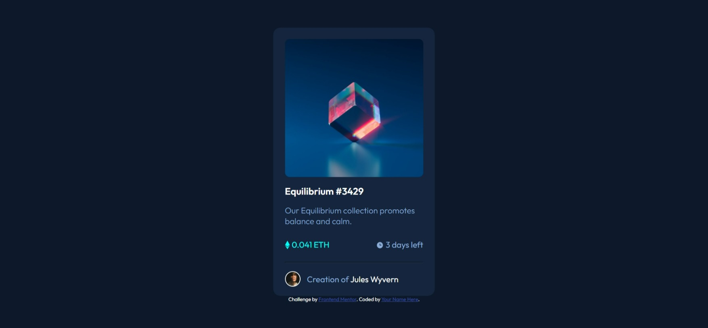
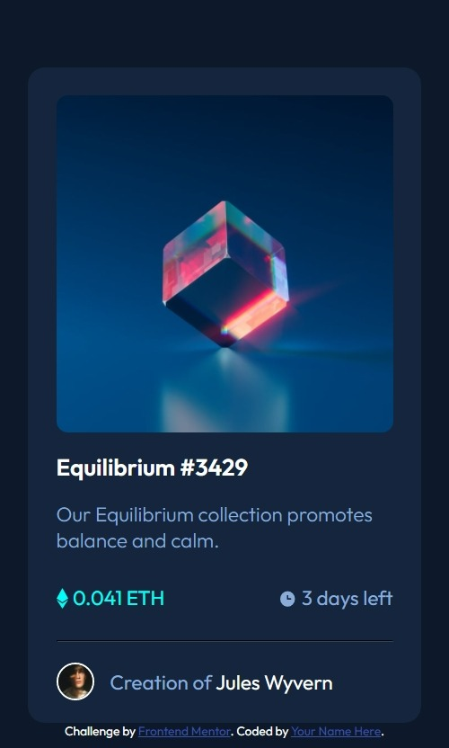

# Frontend Mentor - NFT preview card component solution

This is a solution to the [NFT preview card component challenge on Frontend Mentor](https://www.frontendmentor.io/challenges/nft-preview-card-component-SbdUL_w0U). Frontend Mentor challenges help you improve your coding skills by building realistic projects. 

## Table of contents

- [Overview](#overview)
  - [The challenge](#the-challenge)
  - [Screenshot](#screenshot)
  - [Links](#links)
- [My process](#my-process)
  - [Built with](#built-with)
  - [What I learned](#what-i-learned)
  - [Useful resources](#useful-resources)
- [Author](#author)
- [Acknowledgments](#acknowledgments)

**Note: Delete this note and update the table of contents based on what sections you keep.**

## Overview

### The challenge

Users should be able to:

- View the optimal layout depending on their device's screen size
- See hover states for interactive elements

### Screenshot




### Links

- Solution URL: [https://github.com/Arnav-Ghatti/NFT-Preview-Card](https://github.com/Arnav-Ghatti/NFT-Preview-Card)
- Live Site URL: [https://arnav-ghatti.github.io/NFT-Preview-Card/](https://arnav-ghatti.github.io/NFT-Preview-Card/)

## My process

### Built with

- Flexbox

### What I learned

```css
.eye-img {
    border-radius: 10px;
    opacity: 0;
    position: absolute;
    top: 0;
    left: 0;
    width: 100%;
    height: 100%;
    background: rgba(0, 255, 247, 0.5);
    display: flex;
    flex-direction: column;
    align-items: center;
    justify-content: center;
}
```

### Useful resources

- [Image Hover Effect Tutorial](https://youtu.be/exb2ab72Xhs) - I used this to make the hover effect for the image

## Author

- Frontend Mentor - [@Arnav-Ghatti](https://www.frontendmentor.io/profile/arnav-ghatti)

## Acknowledgments

Thanks to dcode on youtube for helping me with the image hover effect
